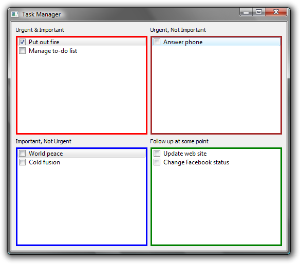

Introduction
------------

Task Manager is a Covey-style tool for keeping track of

*   Enter items in four boxes.
*   Tick off items you've completed.
*   Archive items (with a timestamp) once you're done being proud of having completed them.
*   Customize the labels & date/time format.



Downloads
---------

Task Manager is created with the [Qt application framework](https://www.qt.io/), released under the GNU Public License. That means, among other things, that you are free to download it and use it, but not to re-sell it.

Qt is a cross-platform framework, so there is the possibility for using this on Mac OS X, Linux, etc. Right now I only have Windows executables because I only have a Windows machine. Perhaps some do-gooder will build versions for other operating systems and send them to me.

I build in Windows with this, which assumes that Qt is installed and visible in your path:
```
qmake -config release
mingw32-make
```

Of course your system would have something different from “mingw32-make”—probably just “make”—if you are not building from Windows using MinGW.
